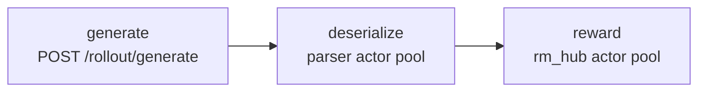

Rollout in miles-diffusion is not "generate everything, then score
everything". Each microgroup is generated, deserialized, and scored as an
independent asyncio task, so reward computation and tensor decoding overlap
with generation that is still in flight. This page covers the three stages of
that pipeline and the knobs that keep each one off the critical path.

## 1. The per-microgroup pipeline

`miles/rollout/sglang_diffusion_rollout.py` runs, per microgroup:



All three stages are timed by `StageTimer` and attached to the samples, so
`perf/rollout_time` decomposes into `generate` / `deserialize` / `reward`
components in the dashboard.

Because every microgroup is its own `asyncio` task (bounded by
`--sglang-server-concurrency` per engine), the engine starts the next request
while previous responses are still being unpacked and scored. Nothing waits
for the full batch.

## 2. Deserialization: msgpack + parser-actor pool

Trajectory tensors are large — for video models the response for one
microgroup can be gigabytes. In an earlier implementation, tensors were
base64-encoded inside a JSON body and parsed on the main asyncio event loop,
one sample at a time; for LTX-2.3 this serialize/deserialize path dominated
`perf/rollout_time`.

The current path:

- **msgpack raw-bytes transport.** The engine responds with
  `application/msgpack`; `post(..., raw=True)` returns the body untouched, and
  tensors decode directly from safetensors raw bytes — no base64.
- **Unpacking runs inside Ray actors, not the event loop.**
  `RolloutImageResponseParserActor.apply_raw(samples, raw)` does
  `msgpack.unpackb` + tensor decode in a separate process
  (`miles/utils/diffusion_rollout_response.py`), so the rollout event loop
  never blocks on a multi-GB unpack.
- **One call per microgroup.** A whole microgroup is parsed in a single
  `apply_raw` call — fewer Ray RPCs, one unpack per response.
- **A pool, round-robin dispatched.** `--rollout-parser-num-workers N` spins
  up N parser actors so multiple microgroups deserialize in parallel. The
  LTX-2.3 recipe sets 8; the default is 1.

Measured on the LTX-2.3 recipe (H200, same config, averaged over two
consecutive RL steps, base64/JSON vs the current path):

| Metric | base64/JSON | msgpack + pool | Speedup |
|---|---|---|---|
| `perf/rollout_time` | 157.4 s | 87.6 s | **~1.8× (−44 %)** |
| `perf/step_time` | 321.9 s | 252.1 s | **~1.28× (−22 %)** |

Per-denoising-step time is unchanged — the entire win is in transfer and
unpacking.

<Note>
Raise `--rollout-parser-num-workers` when `deserialize` stage time approaches
`generate` stage time — typically video models with long trajectories. Image
models are usually fine at the default.
</Note>

## 3. Reward: scored as soon as a microgroup lands

`generate_and_rm_microgroup` calls `batched_async_rm` immediately after
parsing, per microgroup — not once at the end of the rollout:

```python
microgroup = await generate_microgroup(...)   # generate + deserialize
rewards    = await batched_async_rm(args, microgroup)   # score right away
```

Reward workers are Ray actor pools (see [Rewards](/user-guide/rewards) for
per-reward flags), so scoring one microgroup overlaps with generation and
deserialization of the others. Two placement modes:

| Mode | Flags | When |
|---|---|---|
| Dedicated reward GPU(s) | `--pickscore-num-workers N --pickscore-num-gpus-per-worker 1.0` | Default in the PickScore recipes (the "+1 GPU" in 5-GPU layouts) |
| Colocated | `--colocate-reward` (requires `--colocate`) | GPU-tight setups; splits GPU as train 0.7 + rollout 0.25 + reward 0.05 |

One exception: `--group-rm` defers scoring until the full
`n_samples_per_prompt` group is back, for rewards that need the whole group at
once. Streaming then happens at group granularity instead of microgroup
granularity.

## 4. Diagnosing the pipeline

| Symptom | Look at | Likely fix |
|---|---|---|
| `perf/rollout_time` high, engines idle between requests | `deserialize` stage time | Raise `--rollout-parser-num-workers` |
| Rollout stalls at the end of each iteration | `reward` stage time | More reward workers, or a dedicated reward GPU |
| Event loop warnings / slow heartbeat | main-process CPU | Confirm parsing is going through the actor pool (it always does on `main`) |

Related but distinct: `--fsdp-load-mode stream` streams weights
rank-0 → meta-init shards at **startup**; it shares the "stream instead of
materialize everything" philosophy but is not part of the rollout path.

## 5. Pairs well with

- [Single-Prompt Multi-Generation](/advanced/single-prompt-multi-gen) — what a
  microgroup is and how it maps to one engine request.
- [Rewards](/user-guide/rewards) — reward model configuration and custom
  reward hooks.
- [Monitoring](/user-guide/monitoring) — the `perf/*` metrics referenced
  above.
