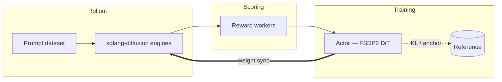

A miles-diffusion training job is a loop over five objects. Once you understand
what each one *is* and how data flows between them, every flag in the system
has an obvious home.

## The five objects



| Object | Role | Lives in |
|---|---|---|
| **Prompt dataset** | Source of prompts (plus optional metadata) | JSONL on disk (`--prompt-data`, `--input-key`) |
| **Rollout (sglang-diffusion engines)** | Denoises prompts into images/videos and records the trajectory | One engine per `--rollout-num-gpus-per-engine` GPUs, behind the miles router (`--use-miles-router`) |
| **Reward workers** | Map `(prompt, generated output) → score` | Built-in `rm_hub` (`--rm-type ocr / pickscore`) or custom (`--custom-rm-path`) — Ray actor pools |
| **Actor (FSDP2 + diffusers)** | The DiT being trained, usually via LoRA | HF checkpoint (`--hf-checkpoint`), family resolved by `TrainPipelineConfig` |
| **Reference** | Frozen anchor for KL / NFT | `--ref-mode lora_base` (the un-adapted base) or `--ref-mode ema` — no second copy of the weights needed with LoRA |

Two differences from the LLM Miles loop are worth calling out:

- **A sample is a trajectory, not a token sequence.** Each rollout sample
  carries the full denoising trajectory: per-step latents, timesteps, sigmas,
  SDE log-probs, and the conditioning tensors needed to replay any step
  (`DiTTrajectory`, `DenoisingEnv` in `miles/utils/types.py`).
- **The model forwards one action, not one sample.** An LLM scores a whole
  trajectory in one forward; a DiT forward covers a single denoising step, so
  the trainer expands samples into `(x_t → x_{t+1})` train pairs before
  batching — see
  `miles/ray/data_conversion_hub/flow_grpo.expand_samples_to_train_pairs` and
  the pair-dispatch refactor in
  [#10](https://github.com/radixark/miles_diffusion/pull/10).

## The training loop

The whole of `train_diffusion.py`:

```python
for rollout_id in range(start_rollout_id, num_rollout):
    # 1. Sample: prompts -> denoising trajectories + SDE log-probs
    rollout_data = rollout_manager.generate(rollout_id)

    # 2. Score: reward per sample, then GRPO advantage normalization
    #    (this happens inside generate, streamed per microgroup)

    # 3. Optimize: expand trajectories to (x_t -> x_{t+1}) pairs,
    #    micro-batch, and step the loss plugin (--loss-type)
    actor_model.async_train(rollout_id, rollout_data)

    # 4. Sync: push updated weights (or LoRA pairs) to rollout engines
    actor_model.update_weights()
```

Every flag in miles-diffusion configures one of these four steps. Offloading
(`--offload-train` / `--offload-rollout`), colocation (`--colocate`), saving
(`--save-interval`) and eval (`--eval-interval`) hook between them.

Step 2 is not a separate phase: rewards are computed asynchronously while
other requests are still generating — see
[Streaming Reward and Deserialization](/advanced/streaming-reward).

## The batch-knob invariant

Two knobs govern the sampling half of the loop, two govern the training half,
and they are locked into a single equation (enforced in
`miles/utils/arguments.py`):

```
rollout_batch_size × n_samples_per_prompt
  = global_batch_size × num_steps_per_rollout
```

Every sample produced by rollout is consumed by training. Set any three;
miles-diffusion fills in the fourth, and aborts on contradiction.

Below the sample level, two more knobs control physical batching:

| Knob | Governs | Notes |
|---|---|---|
| `--diffusion-microgroup-size` | Samples per rollout **request** | One request = one prompt, N outputs — see [Single-Prompt Multi-Generation](/advanced/single-prompt-multi-gen) |
| `--micro-batch-size` | Train pairs per DiT **forward** | Requires the family to implement `collate_cond_for_sample_batch` |

And one knob controls which denoising steps are trained at all:
`--diffusion-step-strategy-path` picks the SDE step subset per rollout
(`sde_window`, `epoch_global_random_choice`, or your own function in
`miles/rollout/step_strategy_hub.py`).

## Where every flag goes

The Python launchers in `scripts/` assemble their command line from named
groups. Use this map when reading any of them:

| Argument group | Concerns |
|---|---|
| `ckpt_args` | `--hf-checkpoint`, `--save`, `--save-interval`, `--load` |
| `rollout_args` | Prompt dataset, the four batch knobs, `--rollout-function-path` |
| `diffusion_args` | Resolution, frames, steps, guidance, SDE noise level, flow shift, step strategy |
| `eval_args` | Eval dataset, cadence, `--diffusion-eval-num-steps` |
| `grpo_args` | `--advantage-estimator`, clip range, KL beta, `--loss-type` |
| `optimizer_args` | LR, Adam betas, weight decay |
| `lora_args` | Rank, alpha, targets, `--lora-ipc-weight-sync` |
| `reward_args` | `--rm-type` and per-reward worker/GPU knobs |
| `sglang_args` | Router, server concurrency, weight-sync buffer and target modules |
| `train_backend_args` | `--train-backend fsdp`, master/reduce/forward dtypes |
| `misc_args` | GPU layout: actor/rollout GPU counts, `--colocate` |

## Next

- [Training Script Walkthrough](/user-guide/training-script-walkthrough) — a
  canonical launcher, group by group.
- [Rewards](/user-guide/rewards) — `rm_hub`, custom reward functions, prompt
  data format.
- [CLI Reference](/user-guide/cli-reference) — every flag, fully cataloged.
- [SDE Step Backend](/advanced/sde-backend) — how train-side log-probs mirror
  rollout stepping.
- [Monitoring](/user-guide/monitoring) — the metrics that tell you whether a
  run is healthy.
