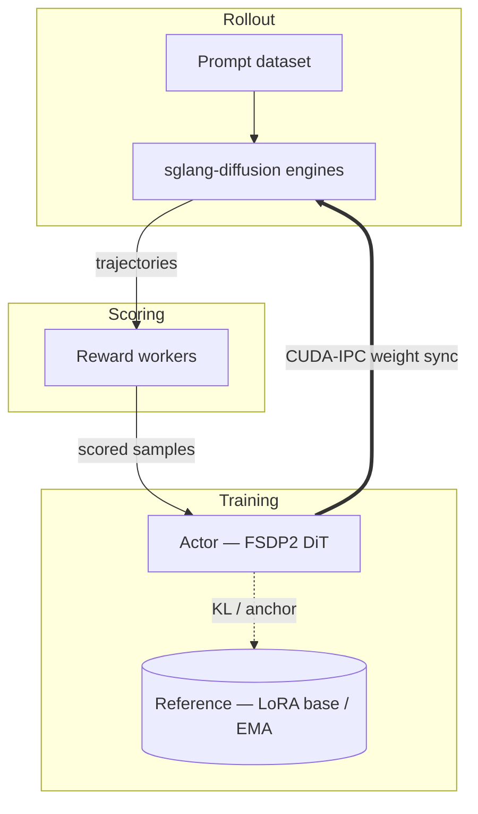

A miles-diffusion training job is a loop over five objects. Once you understand
what each one *is* and how data flows between them, every flag in the system
has an obvious home.

## The five objects



| Object | Role | Lives in |
|---|---|---|
| **Prompt dataset** | Source of prompts (plus optional metadata) | JSONL on disk (`--prompt-data`, `--input-key`) |
| **Rollout (sglang-diffusion engines)** | Denoises prompts into images/videos and records the trajectory | One engine per `--rollout-num-gpus-per-engine` GPUs, behind the miles router (`--use-miles-router`) |
| **Reward workers** | Map `(prompt, generated output) → score` | Built-in `rm_hub` (`--rm-type ocr / pickscore`) or custom (`--custom-rm-path`) — Ray actor pools |
| **Actor (FSDP2 + diffusers)** | The DiT being trained, usually via LoRA | HF checkpoint (`--hf-checkpoint`), family resolved by `TrainPipelineConfig` |
| **Reference** *(optional)* | Anchor for the no-grad DiT forward that KL and NFT compare against | `--ref-mode lora_base` (PEFT `disable_adapter()`) or `--ref-mode ema` (EMA shadow swap-in) — a weight *view* of the actor, never a second loaded copy |

## The training loop

The whole of `train_diffusion.py`:

```python
for rollout_id in range(start_rollout_id, num_rollout):
    # 1. Sample: prompts -> denoising trajectories + SDE log-probs
    rollout_data = rollout_manager.generate(rollout_id)

    # 2. Score: reward per sample, then GRPO advantage normalization
    #    (this happens inside generate, streamed per microgroup)

    # 3. Optimize: expand trajectories to (x_t -> x_{t+1}) pairs,
    #    micro-batch, and step the loss plugin (--loss-type)
    actor_model.async_train(rollout_id, rollout_data)

    # 4. Sync: push updated weights (or LoRA pairs) to rollout engines
    actor_model.update_weights()
```

Every flag in miles-diffusion configures one of these four steps. Offloading
(`--offload-train` / `--offload-rollout`), colocation (`--colocate`), saving
(`--save-interval`) and eval (`--eval-interval`) hook between them.

Step 2 is not a separate phase: rewards are computed asynchronously while
other requests are still generating — see
[Streaming Reward and Deserialization](/advanced/streaming-reward).

## The batch-knob invariant

Two knobs govern the sampling half of the loop, two govern the training half,
and they are locked into a single equation (enforced in
`miles/utils/arguments.py`):

```
rollout_batch_size × n_samples_per_prompt
  = global_batch_size × num_steps_per_rollout
```

Every sample produced by rollout is consumed by training. Set any three;
miles-diffusion fills in the fourth, and aborts on contradiction.

Below the sample level, two more knobs control physical batching:

| Knob | Governs | Notes |
|---|---|---|
| `--diffusion-microgroup-size` | Samples per rollout **request** | One request = one prompt, N outputs — see [Single-Prompt Multi-Generation](/advanced/single-prompt-multi-gen) |
| `--micro-batch-size` | Train pairs per DiT **forward** | Requires the family to implement `collate_cond_for_sample_batch` |

And one knob controls which denoising steps are trained at all:
`--diffusion-step-strategy-path` picks the SDE step subset per rollout
(`sde_window`, `epoch_global_random_choice`, or your own function in
`miles/rollout/step_strategy_hub.py`).

## Where every flag goes

Every argument serves one of the four loop steps. The Python launchers in
`scripts/` assemble their command line from named groups; this map places each
group on its step:

| Loop step | Argument group | Concerns |
|---|---|---|
| **1 · Sample** | `rollout_args` | Prompt dataset, the four batch knobs, `--rollout-function-path` |
| | `diffusion_args` | Resolution, frames, steps, guidance, SDE noise level, flow shift, step strategy |
| | `sglang_args` | Router, server concurrency, `--sglang-*` engine passthrough |
| | `eval_args` | Eval dataset, cadence, `--diffusion-eval-num-steps` |
| **2 · Score** | `reward_args` | `--rm-type`, reward worker pools, advantage-normalization overrides |
| **3 · Optimize** | `grpo_args` | `--loss-type`, `--advantage-estimator`, clip range, KL beta |
| | `optimizer_args` | LR, Adam betas, weight decay |
| | `train_backend_args` | `--train-backend fsdp`, master/reduce/forward dtypes |
| | `lora_args` | Rank, alpha, targets — what the optimizer actually updates |
| **4 · Sync** | weight-sync flags | `--lora-ipc-weight-sync`, `--update-weight-buffer-size`, `--update-weight-target-module` |

Two honest footnotes to that map:

- **A few flags configure the run, not a step.** `ckpt_args` (save/load
  cadence), `misc_args` (GPU layout, `--colocate`, offload), and `wandb_args`
  (logging) describe *where and how often* the steps execute rather than what
  any step does.
- **LoRA straddles steps 3 and 4 by design.** The adapter's shape
  (rank/alpha/targets) is an optimizer concern, but choosing LoRA also decides
  what crosses the wire at sync — which is why recipes keep
  `--lora-ipc-weight-sync` in `lora_args` while the sync transport knobs
  (`--update-weight-*`) sit in `sglang_args`.

The [Training Script Walkthrough](/user-guide/training-script-walkthrough)
goes through a canonical launcher group by group, flag by flag — read it next
if you are about to write or modify a recipe.

## Next

- [Training Script Walkthrough](/user-guide/training-script-walkthrough) — a
  canonical launcher, group by group.
- [Rewards](/user-guide/rewards) — `rm_hub`, custom reward functions, prompt
  data format.
- [CLI Reference](/user-guide/cli-reference) — every flag, fully cataloged.
- [SDE Step Backend](/advanced/sde-backend) — how train-side log-probs mirror
  rollout stepping.
- [Monitoring](/user-guide/monitoring) — the metrics that tell you whether a
  run is healthy.
