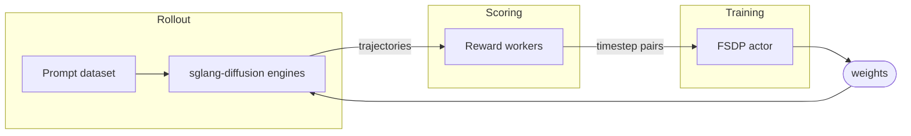

A miles-diffusion training job is a loop over four objects. Once you understand
what each one *is* and how data flows between them, every flag in the system
has an obvious home.

## The four objects



Watch the unit of data change as it crosses the loop. Rollout and scoring
both operate on whole **trajectories** — a full denoising path plus its
decoded output, scored once per generation. Training then expands each
scored trajectory into **(x_t → x_{t+1}) pairs**, and everything below the
sample level counts pairs, not trajectories (see
[the batch-knob invariant](#the-batch-knob-invariant)).


| Object                                 | Role                                                               | Lives in                                                                                                                                              |
| -------------------------------------- | ------------------------------------------------------------------ | ----------------------------------------------------------------------------------------------------------------------------------------------------- |
| **Prompt dataset**                     | Source of prompts (plus optional metadata)                         | JSONL on disk (`--prompt-data`, `--input-key`)                                                                                                        |
| **Rollout (sglang-diffusion engines)** | Denoises prompts into images/videos and records the trajectory     | One engine per `--rollout-num-gpus-per-engine` GPUs, behind the miles router (`--use-miles-router`)                                                   |
| **Reward workers**                     | Map `(prompt, generated output) → score`                           | Built-in `rm_hub` (`--rm-type ocr / pickscore`) or custom (`--custom-rm-path`) — Ray actor pools                                                      |
| **Actor (FSDP2 + diffusers)**          | The DiT being trained, usually via LoRA                            | HF checkpoint (`--hf-checkpoint`), family resolved by `TrainPipelineConfig`                                                                           |

There is no separate reference model. When KL or NFT needs an anchor, the
actor serves a no-grad *view* of its own weights — `--ref-mode lora_base`
(PEFT `disable_adapter()`) or `--ref-mode ema` (EMA shadow swap-in) — never
a second loaded copy.


## The training loop

The whole of `train_diffusion.py`:

```python
for rollout_id in range(start_rollout_id, num_rollout):
    # 1. Sample: prompts -> denoising trajectories + SDE log-probs
    rollout_data = rollout_manager.generate(rollout_id)

    # 2. Score: reward per sample, then GRPO advantage normalization
    #    (this happens inside generate, streamed per microgroup)

    # 3. Optimize: expand trajectories to (x_t -> x_{t+1}) pairs,
    #    micro-batch, and step the loss plugin (--loss-type)
    actor_model.async_train(rollout_id, rollout_data)

    # 4. Sync: push updated weights (or LoRA pairs) to rollout engines
    actor_model.update_weights()
```

Every flag in miles-diffusion configures one of these four steps. Offloading
(`--offload-train` / `--offload-rollout`), colocation (`--colocate`), saving
(`--save-interval`) and eval (`--eval-interval`) hook between them.

## The batch-knob invariant

Two knobs govern the sampling half of the loop, two govern the training half,
and they are locked into a single equation (enforced in
`miles/utils/arguments.py`):

```
rollout_batch_size × n_samples_per_prompt
  = global_batch_size × num_steps_per_rollout
```

Every sample produced by rollout is consumed by training. Set any three;
miles-diffusion fills in the fourth, and aborts on contradiction.

So far this is exactly miles' four-knob invariant. The difference is what a
*sample* is. In miles a sample is one sequence and the ledger stops there.
In miles-diffusion a sample is a whole denoising **trajectory**, and the
fan-out continues below the sample level: a step strategy decides how many
timesteps of each trajectory are trained, and micro-batching counts
**pairs**, not samples.

Here is the full funnel, with the numbers from the canonical Wan2.2 recipe
(`run_diffusion_grpo_wan22_pickscore_5gpu.py`):

```
 48 prompts                          --rollout-batch-size
   │   × 16 generations each         --n-samples-per-prompt
   ▼
768 trajectories ──────────────────  sample level — the invariant:
   │   ÷ 2 optimizer steps              768 = 384 × 2 ✓
   ▼                                 --num-steps-per-rollout
384 trajectories / optimizer step    --global-batch-size
   │   × 1 trained timestep each     step strategy: 1 of the 10
   │                                 SDE steps in each trajectory
   ▼
384 (x_t → x_{t+1}) pairs / optimizer step
   │   ÷ 4 training ranks            dp_size
   ▼
 96 pairs / rank
   │   ÷ 2 pairs per DiT forward     --micro-batch-size
   ▼
 48 gradient-accumulation forwards per rank, then one optimizer step
```

The invariant only constrains the top of the funnel — the trajectory level.
Below it, two independent knobs control physical batching, one per side of
the loop:


| Knob                          | Side     | Governs                         | Notes                                                                                                         |
| ----------------------------- | -------- | ------------------------------- | ------------------------------------------------------------------------------------------------------------- |
| `--diffusion-microgroup-size` | rollout  | Samples per engine **request**  | One request = one prompt, N outputs — see [Single-Prompt Multi-Generation](/advanced/single-prompt-multi-gen) |
| `--micro-batch-size`          | training | Train pairs per DiT **forward** | Requires the family to implement `collate_cond_for_sample_batch`                                              |


And one knob controls the trajectory→pair fan-out itself:
`--diffusion-step-strategy-path` picks the SDE step subset per rollout
(`sde_window`, `epoch_global_random_choice`, or your own function in
`miles/rollout/step_strategy_hub.py`). Training the full 10-step schedule
would multiply the pair count by 10× in the example above; training a small
subset is how video models keep the optimize step affordable.

## Where every flag goes

tbd


## Next

- [Training Script Walkthrough](/user-guide/training-script-walkthrough) — a
canonical launcher, group by group.
- [Rewards](/user-guide/rewards) — `rm_hub`, custom reward functions, prompt
data format.
- [CLI Reference](/user-guide/cli-reference) — every flag, fully cataloged.
- [SDE Step Backend](/advanced/sde-backend) — how train-side log-probs mirror
rollout stepping.
- [Monitoring](/user-guide/monitoring) — the metrics that tell you whether a
run is healthy.

